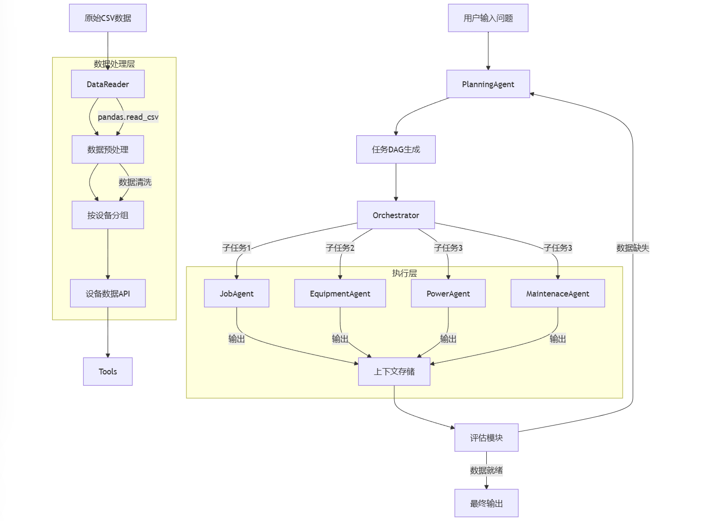

赛题介绍：
本赛题是AI大模型在深远海船舶作业场景下的应用，旨在通过AI大模型提升深远海作业工作效率。从技术视角来看，是探究大语言模型在工业领域时序数据的应用。比赛的成果可应用于船舶作业、高端制造、工程建造等一系列复杂任务协作的场景中，带来工作效率、作业质量和安全水平的提升。
队伍名称：
nongpianzhou

技术架构

在llm目录下面的.env写入自己的api密钥 智谱AI开放平台：https://bigmodel.cn/

运行answer.py

中间跑起来会有一个问题报错，修改->data\results\progress.txt 把当前运行题号+1,且在输出jsonl文件中复制该报错的题目到目标文件（"data\results\nongpianzhousubmit.jsonl"）即可（放弃该题作答）

初赛成果：
A榜：95	nongpianzhou	41.47	2025-02-23 15:44:00
B榜：50	nongpianzhou	24.5	2025-02-25 14:53:36

遇到问题及解决思路​
1.大模型幻觉问题 解决方案：约束增强​
2.Prompt牵一发而动全身 解决方案：prompt框架​
3.数据预处理，时序值转换成动作 解决方案：再调一次大模型用大模型的能力去判断动作

优化方向：
1.完善评估模块
2.并行运行逻辑，提高系统效率
